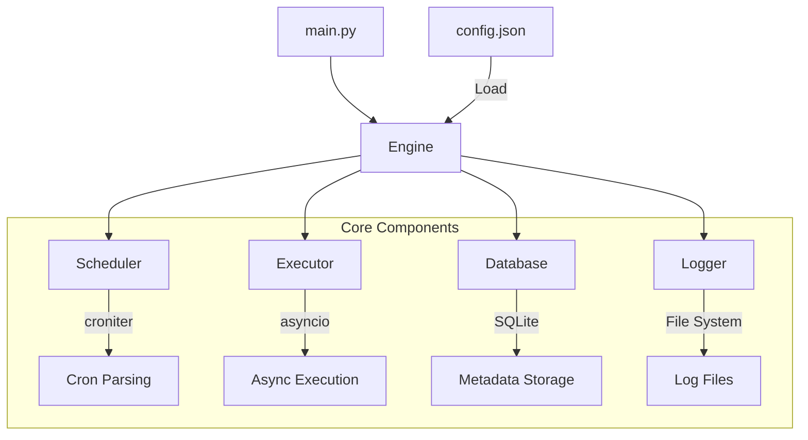
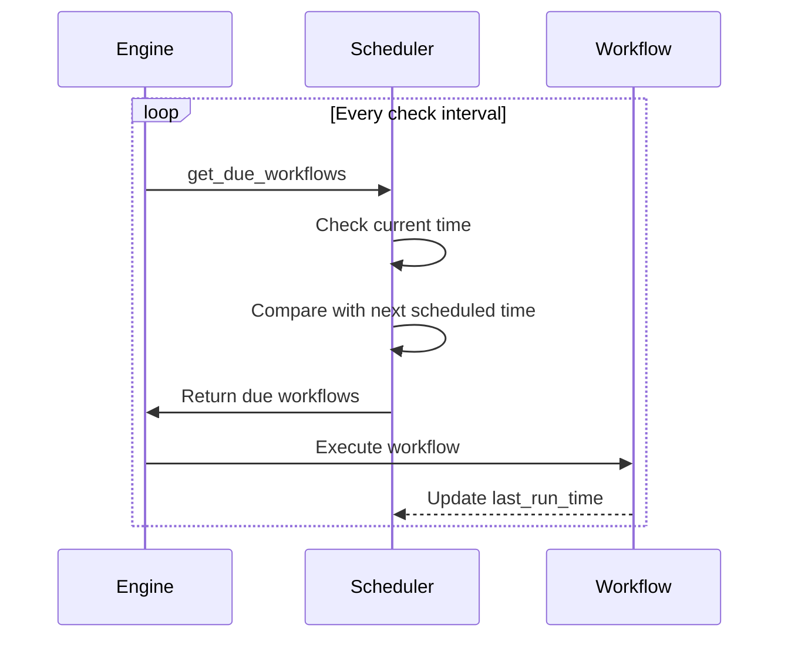
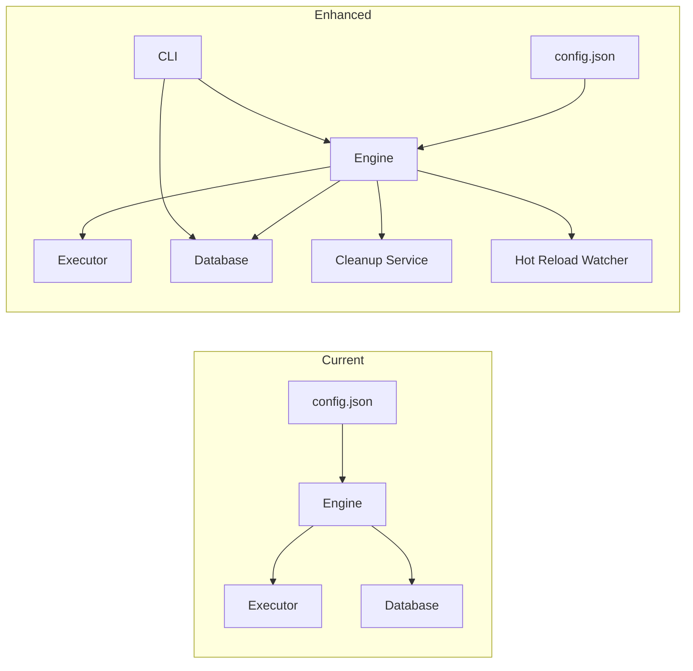

# Workflow Execution Engine - Completion Plan

**Status**: ✅ APPROVED - Implementing all core features

## Confirmed Scope

Based on user feedback, we will implement:
1. ✅ Critical fixes (scheduler bug, concurrency limits, command timeout)
2. ✅ Retry mechanism for failed workflows
3. ✅ Configuration hot-reload capability
4. ✅ CLI commands for status/history management
5. ✅ Workflow validation (duplicate names, invalid cron)

---

## Code Review Summary

I've reviewed your existing codebase. The architecture is well-designed with good separation of concerns:



### What's Working Well

1. **Clean Architecture**: Separation into [`models.py`](src/models.py), [`database.py`](src/database.py), [`logger.py`](src/logger.py), [`scheduler.py`](src/scheduler.py), [`executor.py`](src/executor.py), and [`engine.py`](src/engine.py)
2. **Async Execution**: Using `asyncio.create_subprocess_shell` for non-blocking command execution
3. **Persistent Storage**: SQLite database with proper indexing
4. **Structured Logging**: Per-run log files with timestamps
5. **Graceful Shutdown**: Signal handlers for SIGINT/SIGTERM

---

## Issues Identified

### Critical Issues

#### 1. Scheduler Logic Bug in [`scheduler.py`](src/scheduler.py:38-51)

The `is_due()` method has a timing bug:

```python
def is_due(self, workflow: Workflow) -> bool:
    cron = self._get_croniter(workflow)
    next_run = cron.get_next(datetime)  # This advances the iterator!
    
    now = datetime.now()
    return next_run <= now.replace(microsecond=0)  # Always False for future times
```

**Problem**: `get_next()` advances the internal iterator, and the comparison logic is flawed. A workflow scheduled for every minute will only run once.

#### 2. No Concurrency Limits

The engine spawns unlimited parallel tasks:
```python
for workflow in due_workflows:
    task = asyncio.create_task(self.run_workflow(workflow))  # No limit!
```

This could exhaust system resources with many concurrent workflows.

#### 3. No Command Timeout

Long-running commands will run indefinitely with no way to terminate them.

### Medium Priority Issues

#### 4. Missing Workflow Validation

- No check for duplicate workflow names
- Invalid cron expressions are silently ignored
- No validation of command format

#### 5. No Retry Mechanism

Failed workflows have no automatic retry capability.

#### 6. No Configuration Hot-Reload

Must restart the engine to pick up config changes.

### Lower Priority Issues

#### 7. No Log Retention Policy

Log files accumulate indefinitely.

#### 8. No CLI for Status/History

No way to query run history or status without directly accessing the database.

#### 9. Missing Tests

No unit or integration tests.

---

## Recommended Implementation Plan

### Phase 1: Critical Fixes

#### 1.1 Fix Scheduler Logic

Rewrite the scheduler to properly track last run times:



**Changes needed in [`scheduler.py`](src/scheduler.py)**:
- Track `last_run_time` per workflow
- Calculate `next_run_time` from `last_run_time` or cron schedule
- Properly determine if current time has passed the next scheduled time

#### 1.2 Add Concurrency Limits

**Changes needed in [`engine.py`](src/engine.py)**:
- Add `max_concurrent` parameter
- Use `asyncio.Semaphore` to limit parallel executions
- Queue workflows when limit is reached

#### 1.3 Add Command Timeout

**Changes needed in [`executor.py`](src/executor.py)**:
- Add `timeout` field to Workflow model
- Use `asyncio.wait_for()` with timeout
- Kill process if timeout exceeded

### Phase 2: Enhanced Features

#### 2.1 Workflow Validation

**Changes needed in [`engine.py`](src/engine.py) `load_config()`**:
- Validate unique workflow names
- Validate cron expressions using croniter
- Warn on potentially dangerous commands

#### 2.2 Retry Mechanism

**Changes needed in [`models.py`](src/models.py)**:
- Add `retry_count` and `retry_delay` fields to Workflow

**Changes needed in [`executor.py`](src/executor.py)**:
- Implement retry logic with exponential backoff

#### 2.3 Configuration Hot-Reload

**Changes needed in [`engine.py`](src/engine.py)**:
- Track config file modification time
- Check for changes periodically
- Add SIGHUP handler for manual reload

### Phase 3: Operational Features

#### 3.1 Log Retention

**New file: `src/cleanup.py`**:
- Implement log cleanup based on age or count
- Run as periodic background task

#### 3.2 CLI Commands

**New file: `cli.py`**:
- `status` - Show engine status and next run times
- `history` - Show recent runs
- `logs <run_id>` - Display logs for a specific run
- `enable/disable <workflow>` - Toggle workflows

#### 3.3 Tests

**New file: `tests/`**:
- Unit tests for each component
- Integration tests for full workflow execution

---

## Proposed Configuration Schema Enhancement

```json
{
  "name": "my-workflow",
  "command": "uv run project1/script.py",
  "cron": "*/15 * * * *",
  "enabled": true,
  "timeout": 300,
  "retry_count": 3,
  "retry_delay": 60,
  "max_concurrent": 5,
  "working_dir": "/path/to/project",
  "env": {
    "API_KEY": "secret"
  }
}
```

---

## Architecture Improvements



---

## File Changes Summary

| File | Changes Required |
|------|------------------|
| [`src/models.py`](src/models.py) | Add timeout, retry fields to Workflow |
| [`src/scheduler.py`](src/scheduler.py) | Fix is_due logic, track last_run_time |
| [`src/executor.py`](src/executor.py) | Add timeout handling, retry logic |
| [`src/engine.py`](src/engine.py) | Add concurrency limits, hot-reload |
| [`src/database.py`](src/database.py) | Add cleanup methods for old records |
| `src/cleanup.py` | **NEW** - Log retention service |
| `cli.py` | **NEW** - CLI commands for management |
| `tests/` | **NEW** - Unit and integration tests |
| [`config.json`](config.json) | Add new optional fields |

---

## Questions for Clarification

Before proceeding with implementation, I have a few questions:

1. **Priority**: Which features are most important to you? The critical fixes should be done first, but would you like all enhanced features or just specific ones?

2. **API Monitoring**: Would you like a REST API endpoint for monitoring the engine status remotely, or is CLI sufficient?

3. **Notification**: Would you like notification support (email, webhook) for failed workflows?

4. **Distributed Execution**: Is this intended to run on a single machine, or would you eventually need distributed execution across multiple nodes?
